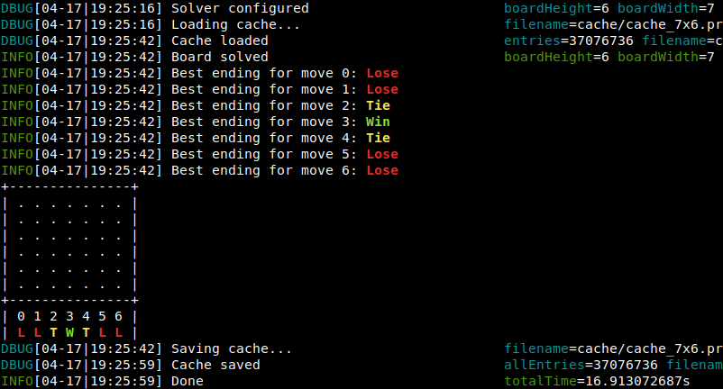

# c4solver
`c4solver` is "Connect 4" Game solver written in Go. 
It finds a winning strategies in "Connect Four" game (also known as "Four in a row").
For instance, the solver proves that on *7x6* board, first player has a winning strategy (can always win regardless opponent's moves).

AI algorithm checks every possible move, traversing the decision tree to the very end, when solving the board.

## Game Rules
> Connect Four is a two-player board game, in which the players take turns dropping colored discs into a seven-column, six-row vertically suspended grid. The pieces fall straight down, occupying the lowest available space within the column. The objective of the game is to be the first to form a horizontal, vertical, or diagonal line of four of one's own discs.

## Quickstart
1. Clone repo: `git clone https://github.com/igrek51/connect4solver && cd connect4solver`
2. Download precalculated endgames: `./cache/pull.sh`
3. Build: `./build.sh`
4. Play interactive game: `./c4solver`

## Building
To build, install [Go](https://golang.org/doc/install) and run:
```bash
go mod download # download dependencies
go build -o c4solver # build ./c4solver binary
```

## Running
### Training mode
In first place, run training mode to evaluate cached results, precalculating every possible scenario:


The following example proves that on 7x6 board, first player can always force a win by starting in the middle column:
```bash
./c4solver --train --size 7x6
```



Precalculating every possible scenario and traversing the decision tree might take a long time on large boards for the first time. 
However, cached endgames are stored in protobuf format and will be used again when playing a game.

### Playing mode
Start a game in an interactive playing mode:
```bash
./c4solver
```

Before making each move, you will see what game endings a particular move leads to (assuming you play with a best, faultless opponent).
You can play against computer AI or analyze each player's moves, showing best game endings for moves (**W** - Win, **T** - Tie, **L** - Lose):


If you want to challenge yourself versus "Unbeatable C4" AI, you can hide the move hints for yourself and enable automatic moves for computer player (Autoattack feature):
```bash
./c4solver --play --size 7x6 --autoattack-a --hide-b
```

## Help / Usage
See help for usage and possible options:
```console
$ ./c4solver --help
Usage of ./c4solver:
  -autoattack-a
    	Make player A move automatically
  -autoattack-b
    	Make player B move automatically
  -browse
    	Browsing mode for debugging purposes
  -cache-limit int
    	Cache memory limit (number of entries)
  -height int
    	board height (default 6)
  -hide-a
    	Hide endings hints for player A
  -hide-b
    	Hide endings hints for player B
  -nocache
    	Load cached endings from file
  -play
    	Playing mode
  -profile
    	Enable pprof CPU profiling
  -retrain int
    	Retrain worst scenarios until given depth (default -1)
  -scores
    	Show scores of each move, analyzing deep results
  -size string
    	board size (eg. 7x6)
  -startwith string
    	Positions of first consecutive moves to start with (eg. 0016)
  -train
    	Training mode
  -width int
    	board width (default 7)
  -win int
    	win streak (default 4)
```

## Search algorithm
AI algorithm strongly solves the board, traversing the decision tree to the very end. It is based on minimax decision rule.
While on 7x6 board there are `4,531,985,219,092` possible positions, some tricks were used to improve search algorithm performance:
- Representing whole board as a binary number (49 bits is enough),
- Winning condition checked using fast bitwise operators (eg. XOR with bitwise shift to find 4 consecutive pieces),
- Caching best game endings for later boards (transposition table) - different moves sequences lead to the same board,
- Disregarding mirrored boards - reflected boards can be treated as the same,
- Alpha-beta pruning - Short-circuit if winning result is found,
- Move ordering heuristics - start from middle moves to find winning strategy earlier,
- Consider only current player's move local neighbourhood when checking winning condition - don't need to check all rows & columns each time, player can win only in his move.

## Results
The optimized solver algorithm is able to consider over 4 millions boards per second, running on a regular laptop.
Still, it takes around a week to solve `7x6` board since number of possible combinations is enormous.

7x6 results:
- solving time: 176 hours (about week),
- over `2_580_000_000_000` iterations (4/7 of all possible boards due to mirrored boards trick),
- maximum depth kept in cache file: 16 (after making 16 moves it's really quick to solve the board without help from precalculated results)

## Testing
```bash
go test ./...
```

## Run benchmarks
```bash
go test --bench=. ./...
```

## Profiling
```bash
./build.sh && ./c4solver --profile --train --size 5x5 --nocache
go tool pprof -http=:8080 cpuprof.prof
```
This produces the following CPU profiling graph, showing the places where CPU spends most of the time for further optimizations:  

